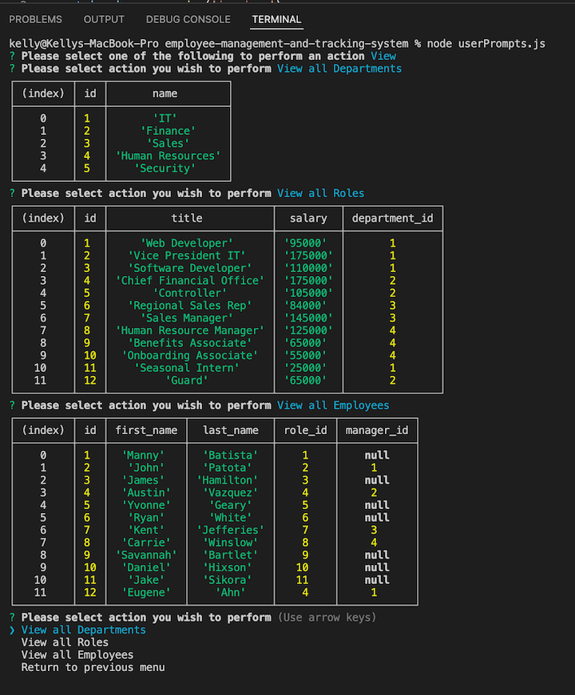

# Employee Management and Tracking System

-------
## Table of Content

- [Description](#description)
- [Installation](#installation)
- [Media](#media)
- [GitHub Repository](#github-repository)
- [Author](#author)  
- [Contributors](#contributors)
- [Technologies Used](#technologies-used) 
- [License](#license)

-------
## Description:  

The Employee Management and Tracking System is a command-line application to manage a company's employee database, using Node.js, Inquirer, and MySQL.

-------
## Installation:

- Clone the repository to your local machine
- Install local dependencies
    * Install npm: 'npm install'
    * Install express: 'npm install express'
- Right click on 'package.json' and select open integrated terminal
- Enter 'npm userPrompts.js' and the application will start
- Follow the prompts to perform the action desired.

------
## Media:  

-----
Video of Employee Management and Tracking System:

- [Media of Employee Management and Tracking System Usage](https://drive.google.com/file/d/18ILLdCLaQtHmYdw15u0e8NjVJpMnBDUj/view?usp=sharing)

https://user-images.githubusercontent.com/97249322/162091148-863e92e4-733a-47f6-bc74-54dcd751c0a3.mp4

----
## Github Repository:

- [Github Repository for Employee Management and Tracking System](https://github.com/ksjefferies/employee-management-and-tracking-system)

## Author:

- [Kelly Jefferies](https://github.com/ksjefferies)

## Technologies Used:

## License:

